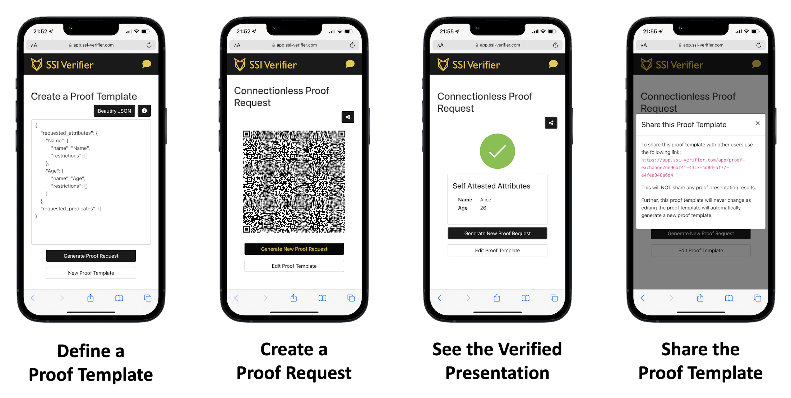

  

---

## 🌈 Table of Contents

- [✅ Features](#-features)
- [🚀 Try it!](#-try-it)
- [🗓 Roadmap](#-roadmap)
- [✉️ Stay Updated](#%EF%B8%8F-stay-updated)
- [✏️ Contribute](#%EF%B8%8F-contribute)
- [❤️ Family and Friends](#%EF%B8%8F-family-and-friends)
- [🧐 FAQ](#-faq)

## ✅ Features

### Open Source

The SSI Verifier is completely open-source. Feel free to contribute, request features, or deploy your own instance.

### Privacy Preserving

Presentations of credentials are highly sensitive data. Therefore, we immediately forward the data to the verifier
who requested the presentation and do not store it in the application itself.

### SSI Standard Agnostic

The SSI Verifier aims to support a variety of SSI credential formats like AnonCreds, JWT Credentials, and BBS+/JSON-LD Credentials. focuses on connectionless proof requests of any
type of verifiable credential.

### Integrated UI and Optimized for Mobile Devices

The SSI Verifier comes with a UI that allows one to use the SSI Verifier without requiring any integration
into the own systems. Moreover, the UI is optimized for mobile devices. In case you want to verify credentials on the go
using your smartphone you now have the chance.

### Many APIs

To integrate the SSI Verifier into you existing systems a variety of API interfaces exist:

- **HTTP API**: Generate new proof requests based on existing proof templates and show them to your user in your own application or even in an email.
- **Webhook and WebSocket Interfaces**: Be notified whenever a new presentation arrives.
- **Open ID Connect Identity Provider (OIDC IdP):** Authenticate and authorize users based on verifiable credentials.

## 🚀 Try it!

Feel free to try out the SSI Verifier here: https://app.ssi-verifier.com

The SSI Verifier is **connected to the IDunion Test Ledger**. When requesting attributes from credentials please ensure that you are referencing credential definitions or schemas that are published on
the IDunion Test Ledger. To view all credential definitions and schemas published on the IDunion Test Ledger use one of the two ledger viewers:

- [Indyscan](https://idunion.esatus.com/home/IDunion_Test)
- [BcGov Viewer](https://idu.cloudcompass.ca/)

As an SSI wallet we recommend using the **Lissi Wallet**: https://lissi.id

## 🗓 Roadmap

### SSI Standards

| Feature                             | Status | Description                                                                                                           |
|-------------------------------------|:------:|-----------------------------------------------------------------------------------------------------------------------|
| AnonCreds + Aries RFC 0037 and 0056 |   ✅    | Request AnonCreds and self-attested attributes using connectionless proof requests and the Present Proof Protocol 1.0 |
| AnonCreds + Aries RFC 0454 and 0434 |   🚧   | Request AnonCreds and self-attested attributes using out-of-band (OOB) messages and the Present Proof Protocol 2.0    |
| BBS+/JSON-LD Credentials            |        | Request BBS+ credentials using out-of-band (OOB) messages and the Present Proof Protocol 2.0                          |
| JWT Credentials                     |        | Request JWT Credentials                                                                                               |

### APIs

| Feature      | Status | Description                                                                    |
|--------------|:------:|--------------------------------------------------------------------------------|
| WebSockets   |  ✅    | Be notified about new presentation results via WebSocket STOMP connections     |
| HTTP API     |   🚧   | Manage proof templates and create new proof requests to show to holders        |
| Webhooks     |        | Be notified about new presentation results via Webhooks                        |
| OIDC IdP     |        | Integrate the SSI Verifier as an  Open ID Connect Identity Provider (OIDC IdP) |

### Web App

| Feature                                           | Status | Description                                                                                                                                |
|---------------------------------------------------|:------:|--------------------------------------------------------------------------------------------------------------------------------------------|
| JSON Editor for Proof Templates                   |   ✅    | Edit proof templates in JSON format                                                                                                        |
| Visualize Proof Requests as QR Codes              |   ✅    | Show proof requests in the form of a QR code that holders can scan using their SSI wallet                                                  |
| Show the Result of a Proof Request                |   ✅    | Show the validated presentation including all credential attributes as well as self-attested attributes                                    |
| Visualize Image-based Credential Attributes       |   ✅    | Render image-based credential attributes as images that can be enlarged by clicking on them                                                |
| Share Proof Templates                             |   ✅    | Share proof templates with other users of the SSI Verifier so that they can generate the same kind of proof requests                       |
| Define new Proof Templates based on existing ones |   ✅    | Editing an existing proof template will not overwrite it but create a new proof template to ensure that the old version continues to exist |
| Form-based Editor for Proof Templates             |        | Edit proof templates using a guided editor                                                                                                 |
| User Accounts                                     |        | Introduces user accounts to create private proof templates that can optionally be shared with other users                                  |
| Groups                                            |        | Invite multiple users into a group to share proof templates between them                                                                   |
| Group Admins                                      |        | Only group admins can invite users to a group and manage the proof templates of the group                                                  |

### Other Features

| Feature       |  Status  | Description                                                                                   |
|---------------|:--------:|-----------------------------------------------------------------------------------------------|
| URL Shortener |         | A URL shortener to shorten the URL encoded proof requests to make the QR codes easier to scan |

## ✉️ Stay Updated

We are working to make everything about the verification of SSI credentials easy. To stay up-to-date with the latest
developments [drop us an email](mailto:hello@ssi-verifier.com?subject=SSI Verifier Mailing List ) and
we will put you on the mailing list. Don't worry, we won't spam you and you can unsubscribe at any time.

## ✏️ Contribute

Everyone is welcome to contribute. Feel free to request a feature or open a pull request.

## ❤️ Family and Friends

This project would not be possible without [AcaPy](https://github.com/hyperledger/aries-cloudagent-python) a big thank you to
all [AcaPy contributors](https://github.com/hyperledger/aries-cloudagent-python/graphs/contributors)!

## 🧐 FAQ

### What is used to build the SSI Verifier?

The SSI Verifier is a Spring Boot application with a server-side rendered web application. To offer a SPA-like user experience [Hotwire](https://hotwired.dev/) is leveraged. To create proof
requests and verify presentations the [AcaPy](https://github.com/hyperledger/aries-cloudagent-python) is used.
Finally, the proof templates are stored in a Postgres database.

### How can I deploy my own instance of the SSI Verifier?

You can find more information about how to build and run your own instance [here](./docs/Build%20and%20Run.md).

### Do I have to deploy my own instance or can I use the public instance?

The instance hosted under [app.ssi-verifier.com](https://app.ssi-verifier.com) exists to be used. Feel free to use it in case you have any use cases you would like to test out.

### Is the presentation data stored permanently?

Due to the sensitivity of the data shared in presentations, the data will only be shared with your own session and immediately removed from the server. This also means that the presentation
data will be inaccessible in case the browser session is exited before the presentation data was shared by the holder.
